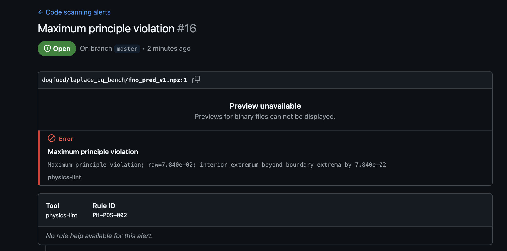

# physics-lint

**A CI linter for trained neural PDE surrogates.** Catches residual, conservation, boundary-condition, positivity, and symmetry violations that MSE misses. Stable rule IDs, SARIF output, GitHub code scanning integration. Think `ruff`, for physics.

by **Jane Yeung** · [github.com/tyy0811/physics-lint](https://github.com/tyy0811/physics-lint) · [physics-lint.readthedocs.io](https://physics-lint.readthedocs.io)

---

## Why physics-lint

A neural PDE surrogate can pass every MSE benchmark and still violate the physics it was trained on. MSE averages spatial error; it says nothing about whether mass is conserved, whether the solution respects the boundary condition, whether a positive initial condition stays positive, or whether a rotationally symmetric problem produces a rotationally symmetric solution. These are the failure modes that matter in production: a climate surrogate that mildly violates energy conservation compounds errors over long rollouts; a medical imaging surrogate that produces negative densities fails downstream pipelines; a structural simulator that breaks reflection symmetry misleads optimization.

physics-lint mechanically checks these properties against calibrated analytical floors, produces actionable warnings with stable rule IDs, and emits machine-readable output that your CI can act on. You add it to your GitHub Actions workflow, it runs on every model PR, and the Security tab shows you exactly which rules fired, which model artifact failed, and a doc link explaining each rule with its mathematical justification and citation.

## Hero: physics-lint in CI



*Above: the FNO `PH-POS-002` alert surfaced in physics-lint's own repository Security tab. The screenshot is from running physics-lint against three trained surrogates from [`tyy0811/laplace-uq-bench`](https://github.com/tyy0811/laplace-uq-bench) — `unet_regressor`, `fno`, `ddpm`. All three failed at least one physics check on the sample; FNO is the most severely flagged because it **uniquely violates the maximum principle** (interior extremum exceeds boundary extrema by 0.078 in a Dirichlet-homogeneous problem), while UNet and DDPM respect the principle cleanly. `PH-POS-002` catches the violation as a code-scanning alert with a physically interpretable message and rule documentation links.*

```yaml
# .github/workflows/physics-lint.yml
name: physics-lint
on: [push, pull_request]

permissions:
  contents: read
  security-events: write

jobs:
  lint:
    runs-on: ubuntu-latest
    strategy:
      fail-fast: false
      matrix:
        model:
          - { name: unet, path: models/unet_adapter.py }
          - { name: fno,  path: models/fno_adapter.py }
          - { name: ddpm, path: models/ddpm_pred.npz }
    steps:
      - uses: actions/checkout@v4
      - uses: actions/setup-python@v5
        with: { python-version: '3.11' }
      - run: pip install physics-lint
      - run: |
          physics-lint check ${{ matrix.model.path }} \
              --config pyproject.toml \
              --category physics-lint-${{ matrix.model.name }} \
              --format sarif \
              --output physics-lint-${{ matrix.model.name }}.sarif
      - if: always()
        uses: github/codeql-action/upload-sarif@v4
        with:
          sarif_file: physics-lint-${{ matrix.model.name }}.sarif
          category: physics-lint-${{ matrix.model.name }}
```

Every model PR populates the GitHub Security tab with rule violations, complete with documentation links and persistent state. `if: always()` on the SARIF upload step means alerts land even when the check step exits non-zero. Configure `[tool.physics-lint.sarif]` to surface violations in PR checks too.

## Installation

```bash
pip install physics-lint
```

Python 3.10 or later. Optional unstructured-mesh support via `pip install physics-lint[mesh]`.

## Quick start

```bash
# Lint a .npz dump
physics-lint check pred.npz --format text

# Lint an adapter (a Python file defining load_model() and domain_spec())
physics-lint check physics_lint_adapter.py --format text

# CI-style SARIF output
physics-lint check model.py --format sarif --category physics-lint-run \
    --output physics-lint.sarif
```

A minimal adapter at `physics_lint_adapter.py`:

```python
from physics_lint import DomainSpec, BCSpec, GridDomain, FieldSourceSpec
import torch

def load_model() -> torch.nn.Module:
    model = MyFNOLaplace()
    model.load_state_dict(torch.load("checkpoints/fno_laplace.pt"))
    model.eval()
    return model

def domain_spec() -> DomainSpec:
    return DomainSpec(
        pde="laplace",
        grid_shape=(64, 64),
        domain=GridDomain(x=(0.0, 1.0), y=(0.0, 1.0)),
        periodic=False,
        boundary_condition=BCSpec(kind="dirichlet_homogeneous"),
        field=FieldSourceSpec(type="callable", backend="auto"),
    )
```

Or drive physics-lint from Python:

```python
from physics_lint.loader import load_target
from physics_lint.report import PhysicsLintReport

loaded = load_target("physics_lint_adapter.py", cli_overrides={}, toml_path=None)
# ... invoke rules, assemble a PhysicsLintReport, render to text/json/sarif
```

## What physics-lint catches

**Broken-model gallery** ([`examples/broken_model_gallery.ipynb`](examples/broken_model_gallery.ipynb)) walks through three cases where MSE ranking and physics-lint ranking disagree:

| Case | Model | What MSE says | What physics-lint catches |
|---|---|---|---|
| 1 | Over-smoothed prediction with boundary leak | MSE ~1e-4 — top of leaderboard | `PH-BC-001` FAIL: doesn't respect Dirichlet BC |
| 2 | Under-trained prediction with localized negatives | MSE ~1e-5 — near-perfect | `PH-POS-001` FAIL: u < 0 in a 5×5 region |
| 3 | Non-equivariant CNN with positional-embedding input | Comparable loss to baseline | `PH-SYM-001`: C4 error 12× baseline |

Cases 1-2 are constructed pathologies labelled after real failure modes on trained neural PDE surrogates. Case 3 is a real trained model. See the notebook for rationale.

## Dogfood: laplace-uq-bench

physics-lint v1.0 is validated against three trained surrogates from [`github.com/tyy0811/laplace-uq-bench`](https://github.com/tyy0811/laplace-uq-bench) — `unet_regressor`, `fno`, and `ddpm` — through a **3-axis cross-comparison** against the repo's published metrics. The v1.0 verdict is `PASS (scoped, MIXED)`:

- **Real axis #1** (`PH-BC-001` vs upstream `bc_err`): full ranking agreement on all three surrogates (DDPM best, FNO worst — FNO's boundary error is ~150× DDPM).
- **Sanity axis** (`PH-RES-001` vs upstream `pde_residual`): rank-1 consistent under a pre-disclosed definitional gap (fd4 vs fd2 stencil, full-grid vs interior scope, L² trapezoidal vs dimensionless RMS).
- **Real axis #2** (`PH-POS-002` vs upstream `max_viol`): magnitude-vs-count definitional gap, resolved in v1.2 via a metrics-compatibility shim.

Full results in [`dogfood/dogfood_real_results.md`](dogfood/dogfood_real_results.md). Methodology notes and reinterpretation rationale in [`docs/tradeoffs.md`](docs/tradeoffs.md).

**v1.2 roadmap.** Expanding to 6 surrogates (adding ensemble, DPS, OT-CFM, improved DDPM, flow-matching), restoring byte-identical sanity-axis comparison via a metrics-compatibility shim, and producing an out-of-distribution "MSE misses what physics catches" scatter figure are tracked in [`docs/backlog/v1.2.md`](docs/backlog/v1.2.md).

## External validation

The dogfood suite validates physics-lint against real trained neural surrogates. The **external validation** suite validates physics-lint against classical PDE theory — textbook theorems, published methodology, and reference-code implementations. Both are required; neither substitutes for the other. Dogfood catches "does the tool rank real models the way the ML ecosystem does"; external validation catches "does the tool compute the quantities its rule IDs claim."

physics-lint v1.0 provides external-validation anchors for all 18 benchmark-anchorable rules. These anchors combine mathematical-legitimacy arguments, correctness fixtures, and, where executable in v1.0, borrowed-credibility reproductions or documented absent-with-justification cases.

**"Externally anchored" is not "formally proven" or "peer reviewed."** Each anchor documents the specific mathematical backbone a rule relies on, verifies the rule's implementation against closed-form or analytical fixtures, and either reproduces a published numerical baseline or documents why no directly-comparable baseline exists in v1.0. Per-rule [`CITATION.md`](external_validation/) files record the exact distribution.

Per the plan's three-function labeling (`docs/plans/2026-04-22-physics-lint-external-validation-complete.md` §1.3):

- **F1 Mathematical-legitimacy** is present for all 18 rules.
- **F2 Correctness-fixture** (CI-runnable implementation check) is present for all 18 rules.
- **F3 Borrowed-credibility** (live published-baseline reproduction) is present for 1 rule (`PH-RES-001`). The other 17 document F3-absent with justification — F3-INFRA-GAP where the required loader / adapter / Modal infrastructure is deferred to v1.x, F3-absent-by-structure for info-flag and V1-stub rules, and F3-absent because no directly-comparable published baseline exists for the rule's specific emitted quantity.

The anchor index, full 18-row matrix, and caveats (V1 stubs, narrower-estimator scoping, section-level textbook framing per the §6.4 primary-source verification discipline) are in [`external_validation/README.md`](external_validation/README.md); per-rule provenance is in each rule's `CITATION.md`.

267 rule-anchor tests + 44 harness/infrastructure tests. Full suite runs in under 30 s on CPU with no GPU / Modal / ImageNet / escnn / e3nn / RotMNIST dependency.

**Honest findings.** External validation during v1.0 development surfaced one real rule-primitive correctness bug in `PH-CON-003` (`np.gradient(edge_order=2)` produced spurious endpoint artifacts on strictly-dissipative eigenmodes at the textbook Evans κ=1 heat case; fixed in `e691dd3` via a forward-difference primitive) and one rule-configuration-dependent norm-equivalence split in `PH-RES-001` (characterized rather than fixed — the rule emits different norms on periodic + spectral vs non-periodic + FD configurations, and the Bachmayr-Dahmen-Oster framework's norm-equivalence claim holds only on the former). See per-rule `CITATION.md` files for details.

**Run:**

```bash
source .venv/bin/activate && pytest --import-mode=importlib external_validation/ -v
```

**v1.2 roadmap.** Items deferred from v1.0 (3D tetrahedral-mesh extension for `PH-CON-004`, full `PH-NUM-001` MMS h-refinement, `PH-SYM-004` adapter-mode upgrade, live PDEBench / Hansen ProbConserv / RotMNIST / escnn / e3nn / Gruver reproductions, tighter hyperbolic norm-equivalence anchors for `PH-VAR-002`) are tracked in [`docs/backlog/v1.2.md`](docs/backlog/v1.2.md).

## v1.0 known limitations

**`PH-BC-001` and `PH-RES-001` in relative mode are rank-ordering reliable but absolute-threshold unreliable on homogeneous-Dirichlet samples** (where the boundary target is identically zero). Both rules divide the raw error by `avg|boundary_target|` (for `PH-BC-001`) or `avg|target|` (for `PH-RES-001`) and apply a floor at machine epsilon (~2.2e-16) when the denominator underflows. On homogeneous-Dirichlet problems the floor dominates, producing `ratio` values of ~1e13–1e14 that trip the relative-mode FAIL threshold for *any* non-zero raw error.

**What this means in practice:**

- The *ranking* across models stays correct — FNO > UNet > DDPM on `PH-BC-001` raw error, matching the laplace-uq-bench `bc_err` table. The dogfood 3-axis ranking agreement (above) is unaffected.
- The *verdict* (`PASS`/`FAIL`) on such samples should not be trusted as an absolute signal. On the v1.0 CI dogfood workflow (sample 0 of `tyy0811/laplace-uq-bench` is homogeneous-Dirichlet), all three surrogates report `PH-BC-001` and `PH-RES-001` FAIL; only the raw magnitudes discriminate.
- Users running CI with `continue-on-error: false` who want to block PRs on *real* BC violations on homogeneous-Dirichlet samples should prefer `PH-BC-001` in `mode = "absolute"` (per-rule override). The per-rule override surface is v1.2 (`docs/backlog/v1.2.md`); until then, use the workflow to surface alerts informatively and gate on other rules.

**Resolution path.** v1.2 regularizes the relative-mode denominator with `max(avg|ref|, absolute_floor)` where `absolute_floor` is a calibrated per-problem-class floor (not machine epsilon), making the ratio meaningful on homogeneous-Dirichlet problems. Tracked in [`docs/backlog/v1.2.md`](docs/backlog/v1.2.md).

**`PH-CON-002` evaluates `raw_value` on dissipative systems, producing FAIL on physically-correct dissipative-by-design behavior.** TGV2D, RPF2D, LDC2D, DAM2D and analogous viscous-SPH systems dissipate energy as a property of the physics; PH-CON-002's relative-drift form (`max|E(t) - E(0)| / |E(0)|`) trips the FAIL threshold on rollouts where ~99% of initial KE has correctly dissipated to viscosity. This is the primary use case for ML PDE surrogates (most ML targets are dissipative); a writeup footnote saying "ignore those FAILs" is harder to defend than the right rule semantics.

The harness layer at `external_validation/_rollout_anchors/_harness/` demonstrates a skip-with-reason mechanism that addresses this — a two-half positive-evidence gate (system_class hint AND KE-monotone-non-increasing) avoids masking buggy supposed-conservative surrogates while restoring correct semantics on dissipative-by-design rollouts. The harness layer is the prototype for v1.x graduation; the v1.0 public PH-CON-002 rule is preserved as-shipped here pending that future D-entry. See [`external_validation/_rollout_anchors/methodology/DECISIONS.md`](external_validation/_rollout_anchors/methodology/DECISIONS.md) D0-18 + the rung 4a writeup at [`external_validation/_rollout_anchors/methodology/docs/2026-05-04-rung-4a-cross-stack-conservation-table.md`](external_validation/_rollout_anchors/methodology/docs/2026-05-04-rung-4a-cross-stack-conservation-table.md) for the full discussion.

## Rule catalog (v1.0)

Each rule has a stable ID (`PH-<CATEGORY>-<NNN>`), a default severity, documented input-mode compatibility, and a doc page with math justification and citation. v1.0 ships **18 rules**.

| Rule ID | Name | Severity | Input modes |
|---------|------|----------|-------------|
| `PH-RES-001` | Residual exceeds variationally-correct norm threshold | error | adapter + dump |
| `PH-RES-002` | FD-vs-AD residual cross-check discrepancy | warning | adapter only |
| `PH-RES-003` | Spectral-vs-FD residual discrepancy on periodic grid | warning | adapter + dump |
| `PH-BC-001` | Boundary condition violation (relative or absolute mode) | error | adapter + dump |
| `PH-BC-002` | Boundary flux imbalance (divergence theorem) | warning | adapter + dump |
| `PH-CON-001` | Mass conservation violation | error | adapter + dump |
| `PH-CON-002` | Energy conservation violation | error | adapter + dump |
| `PH-CON-003` | Energy dissipation sign violation | warning | adapter + dump |
| `PH-CON-004` | Per-element conservation hotspot | warning | adapter + dump (mesh) |
| `PH-POS-001` | Positivity violation | error | adapter + dump |
| `PH-POS-002` | Maximum principle violation | error | adapter + dump |
| `PH-SYM-001` | $C_4$ rotation equivariance violation | warning | adapter + dump |
| `PH-SYM-002` | Reflection equivariance violation | warning | adapter + dump |
| `PH-SYM-003` | SO(2) Lie derivative equivariance violation | warning | adapter only |
| `PH-SYM-004` | Translation equivariance violation (periodic-only in v1) | warning | adapter + dump |
| `PH-VAR-002` | Hyperbolic norm-equivalence conjectural | info | adapter + dump |
| `PH-NUM-001` | Quadrature convergence warning (mesh) | warning | adapter + dump |
| `PH-NUM-002` | Refinement convergence rate below expected | warning | adapter + dump |

`physics-lint rules list` shows this table (<50 ms via lazy registry). `physics-lint rules show PH-RES-001` prints the full per-rule docs including derivation and citation.

**Design-doc future surface (v1.2).** Three additional rules — `PH-VAR-001` (L² residual on second-order strong form), `PH-NUM-003` (non-C² activation scan), `PH-NUM-004` (configured BC vs model training BC) — are deferred to v1.2 along with the `[tool.physics-lint.rules]` per-rule override surface. See [`docs/backlog/v1.2.md`](docs/backlog/v1.2.md).

## Supported PDEs and models

**v1.0 PDE coverage:**

| PDE | Residual | Norm |
|-----|----------|------|
| Laplace | $R = -\Delta u$ | $H^{-1}$ |
| Poisson | $R = -\Delta u - f$ | $H^{-1}$ |
| Heat | $R = u_t - \kappa\Delta u$ | Bochner $L^2(0,T; H^{-1})$ |
| Wave | $R = u_{tt} - c^2\Delta u$ | Bochner $L^2(0,T; H^{-1})$ (conjectural; see `PH-VAR-002`) |

Domains: 2D and 3D structured Cartesian grids. Optional unstructured meshes via scikit-fem (install via `pip install physics-lint[mesh]`).

**v1.0 model coverage:** any PyTorch model loadable via a small adapter file (`torch.nn.Module` or any `Callable[[Tensor], Tensor]`). Iterative samplers and non-PyTorch frameworks use the secondary *dump mode*: save the model's prediction as `pred.npz` with metadata, and physics-lint runs against the tensor directly. JAX, TensorFlow, and NumPy users are supported this way.

**Explicitly out of scope for v1.0:** Navier-Stokes, MHD, compressible flow, AMR, GPU kernels, JAX backend, symbolic PDE definitions, auto-fix.

## How it works

### Three design invariants

**1. Norm-equivalence to error, scoped to the chosen residual formulation.** Every residual rule satisfies a two-sided bound

$$c_B \|r_B(u^\delta)\|_{Y'} \leq \|u - u^\delta\|_W \leq C_B \|r_B(u^\delta)\|_{Y'}$$

(Bachmayr et al. 2024 Eq. 2.13; Ernst et al. 2025 Eq. 3.2–3.3). The constants and the test-space norm $Y'$ depend on the formulation, not the PDE class alone. physics-lint implements the standard second-order residual. For hyperbolic problems, `PH-VAR-002` notes that norm-equivalence is weaker and conjectural.

**2. Self-calibration against numerical floor.** Every rule reports

$$\text{violation\_ratio} = \frac{\text{raw\_violation}}{\text{analytical\_floor}}$$

where the analytical floor is measured by running the same rule on a known analytical solution at the same resolution. Default thresholds: ratio < 10 → PASS; [10, 100] → WARN; > 100 → FAIL. Per-rule overridable via config. Floors live in `physics_lint/data/floors.toml` with per-floor multiplicative tolerance.

**3. Reproduce known empirical results.** The test suite demonstrates physics-lint detects:
- deliberately non-equivariant CNN with positional embeddings violates $C_4$ symmetry by $>2\times$ baseline (see `physics_lint.validation.broken_cnn`);
- real-model disagreement surfaces in the 3-surrogate laplace-uq-bench dogfood (`dogfood/run_dogfood_real.py`);
- the broken-model gallery (`examples/broken_model_gallery.ipynb`) exhibits three MSE-vs-physics-lint disagreement cases.

### Field abstraction

physics-lint represents a trained model's output as a `Field`:

- **`GridField`** — regular Cartesian grid, 4th-order Fornberg FD or Fourier spectral differentiation (auto-selected from the `periodic` flag).
- **`CallableField`** — wraps a `Callable[[Tensor], Tensor]`, derivatives via `torch.autograd.functional.jacobian` batched with `torch.vmap`.
- **`MeshField`** — scikit-fem-backed for unstructured meshes (optional `[mesh]` extra).

All rules operate against the `Field` abstraction and a validated `DomainSpec` (pydantic v2).

### Hybrid loader: adapter + dump

physics-lint supports two model-loading paths, dispatched by file extension:

| Extension | Mode | What you write |
|-----------|------|----------------|
| `.py` | Adapter (primary) | Two functions: `load_model()` and `domain_spec()` |
| `.npz` / `.npy` | Dump (secondary) | Pre-generated prediction with metadata dict |
| `.pt` / `.pth` | Error | Use an adapter or convert to `.npz` |

**Adapter mode** runs the full rule suite including autograd-based rules. **Dump mode** is for iterative samplers (DDPM, DPS), JAX/TensorFlow models, or any case where running the model is expensive or nondeterministic. Rules that require a callable skip gracefully in dump mode with an explicit reason:

```
  ⊘ PH-SYM-003  SKIPPED  SO(2) LEE  requires callable; dump mode
```

Skipped rules appear in the text report, in the JSON report, and in SARIF `run.invocations[].toolExecutionNotifications` — never silent omission. Per-rule PASS outcomes do not emit SARIF results (SARIF results are findings; the Security tab treats every result as an alert).

### GitHub code scanning (SARIF)

SARIF output populates the GitHub Security tab (**Tier 1**, always). Optionally, configuring `[tool.physics-lint.sarif]` with a source file and line region surfaces violations in PR checks (**Tier 2**, opt-in):

```toml
[tool.physics-lint.sarif]
source_file = "train_heat_fno.py"
pde_line = 42
bc_line = 58
```

Tier 3 (arbitrary inline diff comments on unrelated lines) is explicitly not in v1.0.

## Configuration

Canonical config in `pyproject.toml` under `[tool.physics-lint]`; standalone `physics-lint.toml` supported as a fallback.

Minimal (relies on the adapter for everything):

```toml
[tool.physics-lint]
adapter = "./physics_lint_adapter.py"
```

Full v1.0 surface:

```toml
[tool.physics-lint]
pde = "heat"
grid_shape = [64, 64, 32]
domain = { x = [0.0, 1.0], y = [0.0, 1.0], t = [0.0, 1.0] }
periodic = false
boundary_condition = "dirichlet_homogeneous"
diffusivity = 0.01
symmetries = ["D4", "translation_x", "translation_y"]
adapter = "./physics_lint_adapter.py"

[tool.physics-lint.field]
type = "callable"
backend = "auto"

[tool.physics-lint.sarif]
source_file = "train_heat_fno.py"
pde_line = 42
bc_line = 58
```

`physics-lint config init --pde heat` emits a heat-specific commented template. `physics-lint config show --config pyproject.toml` validates your config and pretty-prints the resolved spec (no target required).

**Design-doc future surface.** `[tool.physics-lint.rules]` per-rule overrides (`tol_pass`, `abs_threshold`, `enabled`, `severity`) are specified in the design doc but not wired through the CLI in v1.0. Disable individual rules at run time via `--disable PH-SYM-003`. The full override surface lands in v1.2 per [`docs/backlog/v1.2.md`](docs/backlog/v1.2.md).

## CLI reference

```bash
physics-lint check <target> [--config PATH] [--format {text,json,sarif}] [--category NAME]
                             [--output PATH] [--disable RULE_ID] [--verbose]

physics-lint self-test [--verbose] [--write-report PATH]

physics-lint rules (list | show RULE_ID)

physics-lint config (init [--pde {generic|heat|wave}] | show --config PATH)
```

Exit codes: `0` = all error-severity rules pass; `1` = at least one error-severity rule failed; `2` = invalid config or CLI usage; `3` = model load failed.

## Security

physics-lint `exec`s adapter code — the same trust model as pytest loading `conftest.py`. For local use, fine. In CI contexts, physics-lint runs arbitrary Python with the same token permissions as the job itself. The canonical workflow above sets minimum permissions:

```yaml
permissions:
  contents: read
  security-events: write
```

**Do not grant `contents: write` or `pull-requests: write` unless you need them.** For public-contribution workflows where PR authors and repo owners differ (e.g., model zoos accepting contributions), use `pull_request_target` with branch restrictions per [GitHub's documented guidance](https://docs.github.com/en/actions/security-guides/automatic-token-authentication).

## Development

Methodology tradeoffs in [`docs/tradeoffs.md`](docs/tradeoffs.md). v1.2 backlog in [`docs/backlog/v1.2.md`](docs/backlog/v1.2.md).

**Stack:** Python 3.10+, hatchling, pydantic 2.0+, typer, ruff, pytest + hypothesis, Sphinx + MyST + furo. Apache-2.0 license. Six-job CI matrix (Linux × Python 3.10/3.11/3.12 × NumPy 1.26/2.0 × PyTorch 2.0/2.2/2.5 + macOS arm64). 85% coverage gate.

```bash
git clone https://github.com/tyy0811/physics-lint
cd physics-lint
pip install -e ".[dev]"
pre-commit install
pytest
```

Contributions welcome. File issues for design questions or rule suggestions.

## Citation

```bibtex
@software{yeung_physics_lint_2026,
  author  = {Yeung, Jane},
  title   = {physics-lint: A CI linter for trained neural PDE surrogates},
  year    = {2026},
  url     = {https://github.com/tyy0811/physics-lint},
  version = {1.0.0}
}
```

## Acknowledgments and references

The rule catalog is grounded in:

- Bachmayr, Dahmen, Oster (2024), *Variationally correct neural residual regression for parametric PDEs*, [arXiv:2405.20065](https://arxiv.org/abs/2405.20065).
- Ernst, Rekatsinas, Urban (2025), *A posteriori certification for neural network approximations to PDEs*, [arXiv:2502.20336v3](https://arxiv.org/abs/2502.20336v3).
- Jekel et al. (2022), *Using conservation laws to infer deep learning model accuracy of Richtmyer-Meshkov instabilities*, [arXiv:2208.11477](https://arxiv.org/abs/2208.11477).
- Gruver, Finzi, Goldblum, Wilson (2023), *The Lie derivative for measuring learned equivariance*, ICLR 2023, [arXiv:2210.02984](https://arxiv.org/abs/2210.02984).
- Helwig et al. (2023), *Group equivariant Fourier neural operators for PDEs*, ICML 2023, [arXiv:2306.05697](https://arxiv.org/abs/2306.05697).
- Qiu, Dahmen, Chen (2025), *Variationally correct operator learning*, [arXiv:2512.21319](https://arxiv.org/abs/2512.21319).
- Gustafsson & McBain (2020), *scikit-fem: A Python package for finite element assembly*, JOSS 5(52).
- Trefethen (2000), *Spectral Methods in MATLAB*, SIAM.
- Fornberg (1988), *Generation of finite difference formulas on arbitrarily spaced grids*, Math. Comp. 51(184).

## License

[Apache License 2.0](LICENSE). Patent grant included — safe for commercial-adjacent MLOps pipelines.
