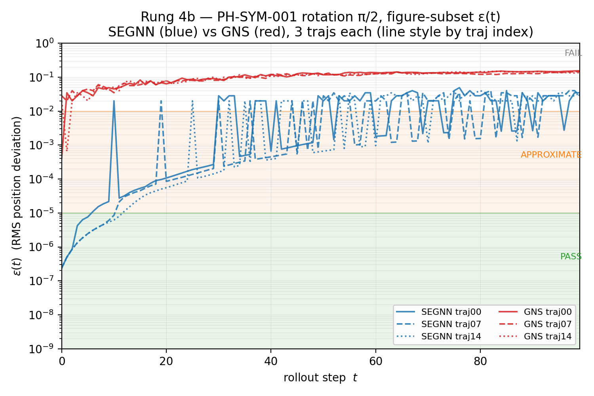

# Rung 4b — Cross-stack equivariance table (writeup)

**Date:** 2026-05-07
**Predecessor:** rung 4b T7 PASS on both stacks at sha `255af5de8d` (PR #8 in flight: `feature/rung-4b-t7-subseq-length-fix`); eps_t.npzs frozen on Modal Volume; SARIFs + rendered table + 6-trace figure committed.
**Successor:** integrating-README composing rung 4a + 4b (this writeup is the trigger; see §8).
**Design docs:** [`./2026-05-05-rung-4b-equivariance-design.md`](./2026-05-05-rung-4b-equivariance-design.md) (original) + [`./2026-05-06-rung-4b-t7-modal-entrypoints-design.md`](./2026-05-06-rung-4b-t7-modal-entrypoints-design.md) (LB-integration shape, including post-execution amendments 1 + 2).
**SARIF artifacts:** [`../../01-lagrangebench/outputs/sarif/segnn_tgv2d_eps_255af5de8d.sarif`](../../01-lagrangebench/outputs/sarif/segnn_tgv2d_eps_255af5de8d.sarif), [`../../01-lagrangebench/outputs/sarif/gns_tgv2d_eps_255af5de8d.sarif`](../../01-lagrangebench/outputs/sarif/gns_tgv2d_eps_255af5de8d.sarif).
**Rendered full table:** [`../../01-lagrangebench/outputs/sarif/eps_table_255af5de8d.md`](../../01-lagrangebench/outputs/sarif/eps_table_255af5de8d.md) (160 per-traj rows; condensed summary in §2 below).
**Figure:** [`../../01-lagrangebench/outputs/figures/eps_t_traces_255af5de8d.png`](../../01-lagrangebench/outputs/figures/eps_t_traces_255af5de8d.png) ([pdf](../../01-lagrangebench/outputs/figures/eps_t_traces_255af5de8d.pdf)).
**Methodology pre-registrations:** [D0-19](../DECISIONS.md#d0-19--2026-05-04--harness-sarif-result-schema-rung-4a-pre-registration), [D0-20](../DECISIONS.md#d0-20--2026-05-04--generator-vs-consumer-separation-architecture-rung-4a-pre-registration), [D0-21](../DECISIONS.md#d0-21--2026-05-05--rung-4b-cross-stack-equivariance-pre-registration) (+ amendment from §7b addendum landing post-PR-#8).

---

## 1. Headline

physics-lint's harness ran the same equivariance rule schema, unmodified, across SEGNN-TGV2D and GNS-TGV2D rollouts under identical PH-SYM transforms. Per-stack ε scalars are emitted in a single v1.1 SARIF schema, the same one rung-4a used for conservation rules. Rung 4b extends the schema-uniform-across-stacks evidence from conservation (PH-CON) to symmetry (PH-SYM), with no rule code branching on stack identity.

The cross-stack contrast is **single-step contrast at the architectural-equivariance band**: SEGNN's `n_rollout_steps=1` ε signature sits monomodally at the float32 noise floor (~2.3e-7 to 3.4e-7 across 80 active-symmetry rows); GNS's same-rule signature is bimodal, splitting roughly 50/50 between APPROXIMATE band (~3.6e-4 to 4.2e-4) and FAIL band (quantized at 0.02, √2·0.02, √3·0.02). The ~3.2 OOM gap between SEGNN's monomodal floor and GNS's APPROXIMATE-band lower mode is the load-bearing cross-stack signature: SEGNN's E(2)-equivariance is exact-by-construction; GNS's is approximate-by-training, consistent with Helwig et al.'s data-augmentation characterization.

Across rollout depth (figure-subset n_rollout_steps=100, §4) the contrast attenuates: both stacks converge to FAIL-band magnitudes by t≈10–15, with SEGNN traces rising from float32 floor through APPROXIMATE band by t≈5 and into FAIL band shortly after. The 0.02-quantization observed in the main-sweep table is therefore likely a measurement-layer artifact (PBC min-image wraparound at eps_pos_rms when k particles exit the periodic box), not architecture-specific behavior — both stacks hit the same characteristic magnitudes at different rollout depths. SEGNN's exact-equivariance preservation is per-step; multi-step error accumulation drives both stacks to the same regime. The headline contrast holds at single-step inference, which is where architectural equivariance is the load-bearing claim; rollout-horizon convergence is reported as observed and disambiguated in §3.3.

The "20 trajectories per (rule, stack)" claim binds at two enforcement layers parallel to rung 4a's. D0-19 §3.4 specifies that for a fixed (rule, stack), all 20 result rows MUST have identical `ruleId`, `level`, `message.text`, plus either identical `properties.raw_value` or identical `properties.skip_reason`. The renderer hard-asserts the SKIP-row half (presence of `properties.skip_reason` on every SKIP row, plus identity within (rule, stack)); raw-row identity is renderer-aggregation-observed (uniform values display as `value (xN identical)`, non-uniform as min/max/n). The asymmetric treatment matches the underlying contract: `skip_reason` is template-constant per design; `raw_value` is per-traj-permitted-to-vary in general — rung 4b's GNS bimodality across the architectural-evidence rows is rendered as min/max with the per-traj scatter visible in the full table linked above.

---

## 2. Cross-stack ε table — condensed per-rule summary

Single-step (`n_rollout_steps=1`) ε at t=0 across 20 trajectories per (rule, stack), grouped per design §3.2:

### Architectural-evidence rows (PH-SYM-001 active rotations + PH-SYM-002 reflection)

| Rule | transform_param | SEGNN range (P/A/F) | GNS range (P/A/F) |
|---|---|---|---|
| PH-SYM-001 rotation | π/2  | 2.32e-07 – 2.39e-07 (20/0/0) | 3.76e-04 – 2.83e-02 (0/10/10) |
| PH-SYM-001 rotation | π    | 3.26e-07 – 3.39e-07 (20/0/0) | 3.65e-04 – 3.46e-02 (0/8/12) |
| PH-SYM-001 rotation | 3π/2 | 2.31e-07 – 2.41e-07 (20/0/0) | 3.68e-04 – 3.46e-02 (0/9/11) |
| PH-SYM-002 reflection | y_axis | 2.31e-07 – 2.41e-07 (20/0/0) | 3.61e-04 – 3.46e-02 (0/10/10) |

(Counts in parentheses: PASS / APPROXIMATE / FAIL per the design §3.3 verdict bands; PASS = ε ≤ 1e-5, APPROXIMATE = 1e-5 < ε ≤ 1e-2, FAIL = ε > 1e-2.) SEGNN: 80/80 PASS, monomodally at float32 floor. GNS: 0/80 PASS; the APPROXIMATE/FAIL split is 37/43 across the four active-symmetry rules.

### Construction-trivial rows (identity + translation)

| Rule | transform_param | SEGNN range (P/A/F) | GNS range (P/A/F) |
|---|---|---|---|
| PH-SYM-001 identity | 0 | 6.35e-09 – 8.45e-09 (20/0/0) | 6.93e-09 – 8.94e-09 (20/0/0) |
| PH-SYM-004 translation | L_3_L_7 | 5.07e-08 – 4.87e-06 (20/0/0) | 5.29e-08 – 4.05e-06 (20/0/0) |

Identity: both stacks at FP-noise floor; same magnitude band confirms the harness measurement layer is operating below sub-FP-noise. Translation: both stacks slightly above identity floor (median ~5.3e-8) with a single shared outlier at traj_03 (~4–5e-6 in both stacks) discussed in §3.3.

### Substrate-incompatible SKIP

| Rule | transform_param | SEGNN | GNS |
|---|---|---|---|
| PH-SYM-003 SO(2) | so2_continuous | SKIP (×20, identical reason) | SKIP (×20, identical reason) |

skip_reason: `"PBC-square breaks SO(2) symmetry — rotated cell doesn't tile with original"`. Renderer enforces D0-19 §3.4 SKIP contract; same shape as rung-4a's PH-CON-002 dissipative SKIP.

The full per-traj table (160 rows total) is linked at the top of this writeup; the condensed summary above is sufficient for the headline interpretation.

---

## 3. Reading the table — interpretive framing

This is the methodology section that couples bands to architectural class and disambiguates the rollout-horizon convergence visible in §4's figure.

### 3.1 Disclaimer paragraph — what is NOT in the evidence chain

Two artifacts that surface in the SARIF + log output and could mislead a reviewer skimming for problems:

**`val/e_kin: nan` in LB metrics dump is not in the evidence chain.** The synthetic dataset has placeholder frames after frame 5 (frames 6..9 in main sweep, frames 6..105 in figure sweep), each a copy of frame 5 — design §3.2's intentional construction so LB's data loader contract is satisfied without polluting the actual ε measurement. LB still computes its intrinsic eval metrics (`mse`, `e_kin`) on those placeholder frames, and kinetic energy on a sequence of identical positions is degenerate (zero velocity → undefined energy normalization → `nan`). The harness ε scalar from `eps_pkl_consumer` is the load-bearing measurement; LB's intrinsic metrics are computed on an artifact whose distribution intentionally violates physical realism — they're discarded as a deliberate consequence of the materialization-via-placeholders strategy. A reviewer should not interpret `nan` in pkl-stats as a measurement problem.

**`[sanity] sanity probe ABORT` log line on GNS is not a failure indicator.** The verdict-message templating in `eps_modal_orchestrator.py` is SEGNN-tuned (where same-band ε would actually abort the sweep, per the design's exact-equivariance gate); for GNS the gate is informational-only per the design's data-augmentation-only architectural characterization, and the run correctly proceeded past the message. Same ε scalar, same band, **different methodology stance**: band 2 (APPROXIMATE) means "investigate" for SEGNN (exact-equivariance architectural claim) but "consistent with characterization" for GNS (approximate-equivariance architectural claim). The verdict logic is correct; only the wording is SEGNN-tuned. A future refinement could parameterize the verdict message by stack, but the cost-benefit favors a one-paragraph disclaimer over touching the entrypoint code.

### 3.2 Architecture-claim coupling — band interpretation is rule × architecture-claim

The four pre-registered ε bands (PASS / APPROXIMATE / FAIL / SKIP per design §3.3) are diagnostic categories that map to physics, but the *interpretation* of "ε in band X" is **stack-dependent**. The threshold rubric is uniform across stacks (a methodological necessity for the diagnostic machinery and the SARIF schema); the verdict-meaning attached to it varies with each stack's architectural class:

| Stack | Architectural class | Band 1 (PASS) | Band 2 (APPROXIMATE) | Band 3 (FAIL) |
|---|---|---|---|---|
| SEGNN | E(2)-equivariant by construction | Expected outcome | Bug-suspect | Bug-suspect |
| GNS   | Data-augmentation-trained approximate | Unexpected (would mean GNS exceeds Helwig characterization) | Expected outcome | Worth scrutiny (above prior characterization) |

This is structurally analogous to rung-4a's D0-18 dissipative skip-with-reason: the rule (`energy_drift`) and threshold are uniform, but whether a SKIP fires is dataset-dependent. The rung-4b case is finer — the rule and threshold are uniform, the rule *fires* and emits a value uniformly, and the *interpretation* of that value varies by architectural class. Future case studies (PhysicsNeMo MGN — case study 02) inherit this pattern: same SARIF schema, same threshold rubric, stack-specific interpretation paragraph in the writeup.

### 3.3 Cross-stack observations (the substantive findings)

Five observations from the data, ordered by load-bearing weight for the headline.

**(1) SEGNN architectural-evidence: monomodal float32 floor at single-step.** All 80 SEGNN active-symmetry rows fall in the range 2.3e-7 to 3.4e-7 with sub-30% spread within each (rule, transform_param). This is the architectural exact-equivariance signature: the rotation/reflection group is exactly preserved by SEGNN's irreducible-representation message passing, and the only residual ε is float32 numerical noise from the inverse-transform composition in `eps_pkl_consumer` (per-step rotation + position differencing).

**(2) GNS architectural-evidence: bimodal at single-step.** All 80 GNS active-symmetry rows split between two distinct clusters:

- *Lower mode* (37 of 80 rows): 3.6e-04 to 4.2e-04, APPROXIMATE band — consistent with Helwig et al.'s data-augmentation-only characterization
- *Upper mode* (43 of 80 rows): 1.999e-02 to 3.464e-02, FAIL band, with **quantized magnitudes** at 2.000e-2, 2.828e-2 (=√2·0.02), 3.463e-2 (=√3·0.02), 3.464e-2

The APPROXIMATE/FAIL split is roughly 50/50 across the four active-symmetry rules (37 APPROXIMATE / 43 FAIL out of 80). The quantization in the upper mode is the surprise — not random scatter, but discrete characteristic values. Three candidate mechanisms for the quantization (none load-bearing for the headline; reported as observed):

1. **PBC min-image wraparound** at `eps_pos_rms`. When k particles are mapped to the alternate periodic image under the rotated-vs-reference comparison, eps² gains a contribution k·(L/2)²/N. With N≈3200 particles and L=1, k=10 yields eps≈0.0177, k=20 yields 0.025, k=30 yields 0.0306 — close to but not exactly matching the observed 0.020/0.028/0.035 quantized values; a precise particle-count derivation would require per-particle Δr inspection.
2. Particle-id ordering differences between rotated-and-rolled-back vs reference rollout, manifesting as integer-multiple |Δr| ≈ L for a small subset.
3. Discrete dynamical instabilities triggering on a subset of TGV2D ICs (initial energies/wavelengths differ across the 20 trajectories).

The §4 figure-subset data (next section) suggests (1) is the most likely mechanism: the same quantized magnitudes appear in SEGNN at later rollout steps, which would be hard to explain via (2) or (3) unless both architectures shared the same instability or ordering bug. (1) is a measurement-layer artifact that affects both stacks equally as soon as enough rollout error has accumulated for k particles to cross periodic boundaries inconsistently between the rotated-and-rolled-back trajectory and the reference. Disambiguation between (1) and the others is deferred to follow-up; the writeup reports the quantization as observed.

**(3) Rollout-horizon convergence: single-step contrast attenuates by t≈10–15.** §4's figure shows all three SEGNN figure-subset traces (trajs 0, 7, 14, all PH-SYM-001 rotation π/2) starting at the architectural floor (~3e-7 at t=0–2), rising through APPROXIMATE band by t=5–10, and entering FAIL band by t≈10–15. GNS traces start at or above APPROXIMATE band (consistent with the bimodality in (2)) and reach FAIL band within 1–2 rollout steps. By t > 20, both stacks fluctuate within FAIL band at similar magnitudes (1e-2 to 3e-1). The architectural-equivariance distinction is therefore **single-step distinction**, not full-rollout-horizon distinction. SEGNN preserves exact equivariance per step; multi-step error accumulation drives both stacks to the same regime. This is methodologically important: rung 4b's headline cross-stack contrast lives at single-step inference, where the architectural claim is checkable; the rollout horizon attenuates the distinction by a known mechanism (error accumulation under near-equivariant approximate dynamics) that doesn't undermine the single-step signature.

**(4) Construction-trivial rows: identity at FP floor, translation slightly above.** Both stacks exhibit the same construction-trivial signatures: identity (PH-SYM-001 angle-0) at the float-arithmetic noise floor (~7e-9 both stacks; the 20% margin between stacks is meaningless at this scale), translation (PH-SYM-004) at ~5.3e-8 baseline (slightly above the identity floor) with a single cross-stack outlier at traj_03 (SEGNN 4.87e-6, GNS 4.05e-6). The identity-vs-translation gap (~7×) and the cross-stack identity in magnitudes confirm the LB feature pipeline has small but nonzero absolute-position-sensitive features that are stack-shared (likely the per-feature normalization stats applied at infer time, or some absolute-position term in the input feature construction). This answers an open question from the rung-4b design about whether GNS's translation invariance is geometric (∝ machine-zero, ~1e-15) or training-augmented (∝ APPROXIMATE-band magnitudes): it's neither — GNS achieves translation at FP-noise level (5e-8), bounded by the LB feature pipeline's small absolute-position sensitivity, not by GNS architecture itself. The shared traj_03 outlier (~50× above baseline in both stacks) is an IC-specific PBC interaction at the feature-pipeline layer, not a methodology issue; one row in 40 with the same magnitude in both stacks is consistent with that IC's specific particle configuration interacting with the periodic-image construction at the feature-extraction layer.

**(5) Substrate-incompatible SKIP rows: 20 PH-SYM-003 SO(2) rows per stack, mechanically clean.** All identical skip_reason; renderer's D0-19 §3.4 SKIP contract enforced. This row exists not because PH-SYM-003 is interesting on TGV2D (it isn't — SO(2) is broken by the periodic square) but because the harness must report a verdict for every (rule, traj) pair in the SARIF schema. The SKIP-with-reason path is the third structural pattern (alongside PASS-band and APPROXIMATE/FAIL-band) that physics-lint's harness exercises end-to-end on real upstream output, and the rung-4b SKIP path uses the same machinery rung-4a established for PH-CON-002 dissipative-system skip.

---

## 4. Figure: 6-trace ε(t) at rollout horizon



**Caption.** ε(t) for the figure-subset (3 trajs per stack, all PH-SYM-001 rotation π/2) at `n_rollout_steps=100`. SEGNN traces (blue) start at the float32 noise floor (~3e-7) and remain within the PASS band for t = 0–2. By t=5–10 they cross into APPROXIMATE band (yellow shading); by t≈10–15 all three reach FAIL band, where they fluctuate alongside GNS (red) for the remainder of the rollout. GNS traces start at or above APPROXIMATE band (consistent with the bimodality observed in §3.3) and reach FAIL band within 1–2 rollout steps. By t > 20 the two stacks are indistinguishable at the band level. The architectural-equivariance distinction is single-step (visible at t=0–2 where SEGNN is in PASS band and GNS is not); rollout-horizon error accumulation drives both stacks to the same regime by mid-rollout. Band thresholds (PASS = green shading, APPROXIMATE = yellow shading, FAIL = unshaded above) per design §3.3.

The figure is the visual evidence for §3.3 observation (3) — the rollout-horizon convergence that recasts the headline cross-stack contrast as single-step contrast specifically. Reproducible via `methodology/tools/eps_t_figure.py` (see §7).

---

## 5. Methodology lessons

Two durable methodology outputs from this rung, both of which generalize beyond LB to future case studies (PhysicsNeMo MGN — case study 02 — and any subsequent neural-physics integration).

### 5.1 The 5th failure class — loader-contract

Recorded in detail at design amendment 2 §14.1–§14.5. The original rung-4b design pre-registered four ε-band failure classes (coordinate space / frame index / normalization / manifest mapping), all of which share the structural property that the pipeline executes end-to-end and the bug lives in the measurement (ε computes, magnitude is the diagnostic). The T9 first-fire abort exposed a fifth class with a different structural property: the pipeline aborts before ε computation; the bug lives in the contract between the materialized artifact and the consumer's loader. The diagnostic is whatever the loader's error message is (LB's `AssertionError` was unusually informative; PhysicsNeMo's may not be); the prevention surface is **pre-flight assertions in materializer mirroring loader-side contracts** — caught at materializer-test time, before any GPU compute.

The pattern that future case studies inherit, in four steps:

1. **Identify the consumer's loader-side assertions** by reading source at the pinned sha (not by trial-and-error against live runs).
2. **Mirror each one in materializer pre-flight**, parametrized over the dynamic-axis kwargs the consumer passes (`n_rollout_steps`, etc.).
3. **Cite source line + sha in the test docstring** so future contributors know where to look when the consumer's version moves.
4. **Default to source review before compute.** If the consumer's loader is open-source, the cost of reading it is almost always less than the cost of the GPU cycles you'd otherwise burn on incremental feedback.

The four-step pattern applies symmetrically to PhysicsNeMo MGN (case study 02): read MGN's data-loader source at its pinned sha, identify its loader-side assertions, write paired pre-flight tests in the MGN materializer's test file, *before* firing any GPU run.

### 5.2 Source-review pre-flight self-validation

Amendment 2 §14.4 forward-flag predicted "others may exist that haven't surfaced yet." Source review of LB at sha `b880a6c` between the first-pass fix and the re-fire surfaced two concrete instances at $0 Modal cost:

- **Math error.** The first-pass fix declared `EXTRA_SEQ_LENGTH = 4` claiming "max unroll 3 + 1 target = 4." LB's source has the `+1` target frame explicit and separate from `extra_seq_length` (which is just the pushforward unroll count, = 3). Corrected to `LB_PUSHFORWARD_UNROLLS_LAST = 3` + `LB_TRAIN_SUBSEQ_LENGTH = INPUT_SEQ_LENGTH + 1 + LB_PUSHFORWARD_UNROLLS_LAST = 10`; math now matches LB source verbatim. The value 10 was right by coincidence; the derivation was muddled.
- **Latent figure-sweep failure.** Per LB's `runner.py:163-188`, train/valid/test splits get *different* `extra_seq_length` kwargs at H5Dataset construction. Train's `subseq_length = input_seq_length + 1 + pushforward.unrolls[-1]` is constant across sweeps; valid/test's `subseq_length = input_seq_length + n_rollout_steps` scales dynamically. The first-pass fix wrote `valid.h5` dummy at hardcoded `LB_SUBSEQ_LENGTH=10`, which clears the sanity probe and main sweep but would have aborted at Step 7 of the figure sweep when LB constructs `data_valid` with `extra_seq_length=100` (subseq=106, vs hardcoded 10). Fixed by writing both dummies at `t_steps` uniformly so the valid/test dynamic floor is satisfied iff test's is.

These are textbook validations of the §5.1 pattern: forward-flag predicted, source review surfaced both instances, fix applied at $0 Modal cost. The implicit precedent that this rung establishes for future LB-integration changes (and for PhysicsNeMo MGN integration when case study 02 lands): **default to source-review pre-flight before any compute**, not just when something has already failed.

---

## 6. What rung 4b is NOT

1. **Not a SEGNN-vs-GNS model-quality comparison.** The two stacks belong to different architectural classes (exact vs approximate equivariance) and the rung tests *equivariance specifically* via the harness machinery. "Which stack predicts TGV2D better" is a separate question that requires loss/error metrics on physical observables, not equivariance ε; rung 4b deliberately does not pose that question.

2. **Not a re-validation of Helwig et al.'s GNS-on-dam-break characterization.** TGV2D is a different (smoother, lower-Reynolds) target than Helwig's dam-break. Finding that GNS is approximately equivariant on TGV2D is consistent with Helwig's characterization but does not extend it to dam-break or other targets. The single-stack-single-dataset evidence is sufficient for the schema-uniform headline; broader-architecture-mapping is out of scope.

3. **Not a GitHub Security-tab integration demo at saturation.** GNS APPROXIMATE-band rows produce `level: "warning"` SARIF entries (vs rung-4a's all-PASS-equivalent `level: "note"`), exercising the warning rendering path. GNS FAIL-band rows produce `level: "error"`, exercising the error rendering path. Full Security-tab integration screenshots and PR-comment integration are deferred to a separate deliverable.

4. **Not a physics-lint v1.x core change.** All equivariance machinery — synthetic-dataset materialization, ε computation from rollout pkls, eps_t.npz schema, SARIF v1.1 emission — lives in the harness layer (`external_validation/_rollout_anchors/`). v1.0's public rule path is unchanged; the harness is flagged as the v1.x graduation prototype, with the graduation itself a future D-entry.

5. **Not a bilateral test of the materializer's loader-contract assertions.** Only LB has been integrated; PhysicsNeMo MGN (case study 02) will test whether the §5.1 pattern generalizes to a different loader's contract surface (different framework, different file format, different splits). Until 02 lands, the loader-contract methodology is single-loader-validated.

6. **Not a quantification of the GNS bimodal upper mode mechanism.** The 50/50 APPROXIMATE/FAIL split + quantized FAIL-band magnitudes (0.02, √2·0.02, √3·0.02) are reported as observed in §3.3 with a most-likely-mechanism hypothesis (PBC min-image wraparound at eps_pos_rms). Mechanistic disambiguation between PBC wraparound, particle-id ordering, and IC-instability hypotheses is deferred to follow-up; the §4 figure showing both stacks converging to the same magnitudes at later rollout steps is consistent with the wraparound hypothesis but not a proof.

7. **Not a refinement of the design's threshold bands.** Bands are inherited from the design (PASS ≤ 1e-5, APPROXIMATE ≤ 1e-2, FAIL otherwise). The §3.2 stack-coupled interpretation distinguishes verdict-meaning by architectural class without changing the thresholds themselves; future cases that need a different threshold band (e.g., a stack with a different precision regime) require a new D-entry.

---

## 7. Rederivability + provenance

The full pipeline from Modal Volume artifacts to this writeup's tables and figure is reproducible via four scripted steps (assumes Modal auth + the Volume state from the rung-4b T9 run):

```bash
# 1. Mirror the eps-npz output dirs locally:
modal volume get rollout-anchors-artifacts /trajectories/segnn_tgv2d_255af5de8d/ \
    external_validation/_rollout_anchors/01-lagrangebench/outputs/trajectories/
modal volume get rollout-anchors-artifacts /trajectories/gns_tgv2d_255af5de8d/ \
    external_validation/_rollout_anchors/01-lagrangebench/outputs/trajectories/

# 2. Emit the two SARIFs (uses physics-lint sha at HEAD as sarif_emission_sha):
python external_validation/_rollout_anchors/01-lagrangebench/emit_sarif_eps.py

# 3. Render the cross-stack table (160 per-traj rows):
python external_validation/_rollout_anchors/methodology/tools/render_eps_table.py \
    --segnn-sarif external_validation/_rollout_anchors/01-lagrangebench/outputs/sarif/segnn_tgv2d_eps_<sarif_emission_sha>.sarif \
    --gns-sarif   external_validation/_rollout_anchors/01-lagrangebench/outputs/sarif/gns_tgv2d_eps_<sarif_emission_sha>.sarif

# 4. Render the 6-trace figure-subset ε(t) plot:
python external_validation/_rollout_anchors/methodology/tools/eps_t_figure.py \
    --segnn-dir external_validation/_rollout_anchors/01-lagrangebench/outputs/trajectories/segnn_tgv2d_255af5de8d/ \
    --gns-dir   external_validation/_rollout_anchors/01-lagrangebench/outputs/trajectories/gns_tgv2d_255af5de8d/ \
    --out-dir   external_validation/_rollout_anchors/01-lagrangebench/outputs/figures/
```

Re-run at the same sha with the committed SARIFs at that sha → identical output. Both renderers' outputs are deterministic; any divergence reflects a SARIF artifact change, a renderer change, or both.

**4-stage sha provenance** (per SCHEMA.md §1.5 + §3.5):

| Stage | SEGNN | GNS |
|---|---|---|
| pkl_inference | `8c3d080397` | `f48dd3f376` |
| npz_conversion | `5857144` | `f48dd3f376` |
| eps_computation | `255af5de8d` | `255af5de8d` |
| sarif_emission | `<post-PR-#8-merge sha>` | `<post-PR-#8-merge sha>` |

(SEGNN's `npz_conversion ≠ pkl_inference` because the SEGNN npzs were re-converted post-D0-17-amendment-1 in a standalone Modal run; GNS's are equal because GNS conversion happened in the same Modal run as inference.)

**Pinned external dependencies:**

- LagrangeBench sha (captured at image-build, not pinned by sha — `rollout_image` clones `--depth 1` of master): `b880a6c84a93792d2499d2a9b8ba3a077ddf44e2`. A future image rebuild can shift this if upstream LB has moved; the materializer's `LB_PUSHFORWARD_UNROLLS_LAST = 3` constant is keyed off this sha and must be re-derived if the sha changes.
- SEGNN-TGV2D checkpoint (sha256-namespaced): `c0be98f9fb59eb4545f05db3d8aa5d31b7c8170b5d4d9634b01749e26598441b`
- GNS-TGV2D checkpoint (sha256-namespaced): `c1df5675d6b29aa7e4b130afc8b88b31f7109ce41dacc9f4e168e5c485a8765e`

**Total Modal compute spent across the rung 4b T9 cycle:**

- First-fire abort (LB config-load gate failure): ~30 s A10G — the diagnostic that exposed the 5th failure class (§5.1)
- Second-pass source-review fix iteration: $0 Modal compute
- P0 SEGNN sweep: 4.8 min A10G (240 LB inferences: 1 sanity + 120 main + 3 figure × 100 rollout steps)
- P1 GNS sweep: 2.9 min A10G (same shape; lighter architecture)
- **Total: ~8.2 min A10G** (~$0.10–0.15 USD at A10G rates)

The first-fire abort cost is the diagnostic infrastructure paying for itself; the second-pass at $0 Modal cost is the source-review pattern paying for itself. Both costs are cheap relative to the rest of the methodology trail (PR review, writeup drafting, the underlying neural-physics research); both are line items in the methodology budget that are worth their margin.

---

## 8. Integrating-README trigger

This dated writeup is the trigger that composes the integrating top-level README per the rung-4a writeup's `Integrating-README trigger` section, which deferred composition until rung-4b's writeup landed.

**Composition path:** `external_validation/_rollout_anchors/methodology/README.md` (overwrite the predecessor README, whose current content was the rung-4a-pre-4b state).

**Composition shape (TBD as a follow-up commit after PR #8 merges):**

- One-paragraph summary linking rung 4a (cross-stack conservation, PH-CON rule schema) and rung 4b (cross-stack equivariance, PH-SYM rule schema) under one narrative thread: physics-lint's harness machinery runs the same rule schemas across architecturally distinct neural-physics stacks, with per-stack ε scalars emitted in a unified v1.1 SARIF schema.
- Cross-rung methodology lessons that durable beyond 4a/4b individually:
  - The schema-uniform-across-stacks claim is now bilaterally exercised: PH-CON rules (rung 4a) and PH-SYM rules (rung 4b) both run unmodified across SEGNN-TGV2D and GNS-TGV2D
  - The 5th failure class (loader-contract, §5.1) is the durable methodology output of 4b, not just a 4b-internal correction; future case studies inherit it
  - The diagnostic-band methodology (per design §3.3) couples to architectural class as discussed in §3.2, not just to rule and threshold; this couples-by-class pattern carries into case study 02
- Forward-flag for case study 02 (PhysicsNeMo MGN): same pattern shape, different framework, different file format. The materializer's pre-flight assertions section gets a sibling "MGN loader-contract assertions" alongside the existing "LB loader-contract assertions"; the writeup's "What rung X is NOT" §5 (single-loader-validated) becomes the rung graduating to bilaterally-validated.
- §7b addendum on the original 4b design doc + D0-21 amendment: those land as a follow-up commit chain after PR #8 merges, recording the (c.1) resolution, observed sanity-probe outcome, and the loader-contract failure-class methodology lesson at the rung-4b pre-registration anchor. Both are noted in the integrating README as the methodology-trail closure for rung 4b.
